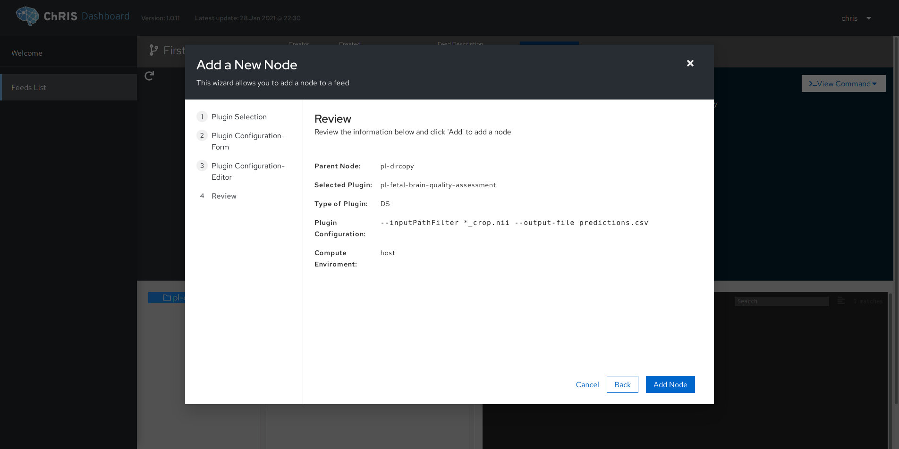

# Automatic Fetal Brain MRI Quality Assessment


[](https://github.com/fnndsc/pl-fetal-brain-assessment/blob/main/LICENSE)

Score a NIFTI (`.nii`, `.nii.gz`) file on a scale from 0 to 1 based on quality using machine learning.

Fetal brain MRI quality is negatively affected by image noise and motion artifacts.


## Abstract

The aim of this project was to develop a Quality Assessment tool for fetal brain MRIs,
which is able to score each volume through a deep learning regression model.
Developed using Python3 and Keras/Tensorflow framework.

Our network architecture consists of a non-linear configuration, known as Residual Network (ResNet) architecture: 


Given that we are dealing with an unbalanced distribution regarding input dataset,
we applied different weights to each input class to compensate for the imbalance in the training sample.

https://youtu.be/H2VNJN-7xZ8?t=494

This repository contains the tool to be used for predications and downstream research.
For model training and validation, see
https://github.com/ilegorreta/Automatic-Fetal-Brain-Quality-Assessment-Tool

## System Requirements

- [Docker >18.09](https://docs.docker.com/get-docker/)
- [NVIDIA Container Toolkit](https://github.com/NVIDIA/nvidia-docker)
- drivers supporting CUDA version 11.1 (check with `nvidia-container-cli info`)

## Development

```bash
DOCKER_BUILDKIT=1 docker build -t fnndsc/pl-fetal-brain-assessment .
```

<details>
<summary>What's BuildKit?</summary>
Our <code>Dockerfile</code> leverages advanced features of Docker.

<ul>
<li>https://github.com/moby/moby/issues/15717#issuecomment-493854811</li>
<li>https://docs.docker.com/engine/reference/builder/#buildkit</li>
</ul>
</details>

## Usage

`fetal-brain-assessment` is a [ChRIS](https://chrisproject.org/) plugin.


Below is what the plugin options look like in ChRIS_ui.



### Using Docker Run

Run analysis directly on your machine in the command line.

```bash
$ ls input
scan-AX-1-3mm_crop.nii
scan-AX-2-3mm_crop.nii
scan-COR-1-3mm_crop.nii
scan-COR-2-3mm_crop.nii
scan-SAG-1-3mm_crop.nii
scan-SAG-2-5mm_crop.nii
scan-SAG-3-3mm_crop.nii

$ mkdir output

$ docker run --rm --gpus all -u $(id -u):$(id -g)                \
    -v /etc/localtime:/etc/localtime:ro                          \
    -v $PWD/input:/incoming:ro -v $PWD/output:/outgoing:rw       \
    fnndsc/pl-fetal-brain-assessment:1.1.0                       \
    fetal_brain_assessment --verbosity 3                         \
    --inputPathFilter '*_crop.nii' --output-file predictions.csv \
    --threshold 0.4 --destination Best_images_drop               \
    /incoming /outgoing

$ cat output/predictions.csv
scan-COR-1-3mm_crop.nii,0.6486295
scan-SAG-1-3mm_crop.nii,0.31944746
scan-AX-1-3mm_crop.nii,0.25669065
scan-SAG-2-5mm_crop.nii,0.26366436
scan-SAG-3-3mm_crop.nii,0.32725734
scan-AX-2-3mm_crop.nii,0.45316696
scan-COR-2-3mm_crop.nii,0.32879326

$ ls output/Best_images_drop
scan-COR-1-3mm_crop.nii
scan-AX-2-3mm_crop.nii
```

### Using Singularity

```bash
singularity exec --nv docker://fnndsc/pl-fetal-brain-assessment:1.1.0 fetal_brain_assessment in out
```
